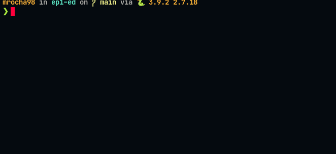

# EP1 – Comparando Algoritmos de Ordenação – ED FATEC SJC – Python

## Enunciado

Neste EP1 você deverá programar os algoritmos ordenação por seleção, mergesort, quicksort, sort interno e comparar os tempos. Este EP1 deverá ser feito em Python 3.x e a saída deverá ser em formato texto na tela (não utilizar interface GUI  e nem grave arquivo de saída).

1. Diferente do EP1 da turma anterior você não precisa pedir opções ao usuário, basta mostrar todos os tempos até passarem **um tempo de aproximadamente meio minuto**.
2. Depois você iniciará um loop onde irá testando diferentes vetores aleatórios, começando com 2000 inteiros e incrementando de mais 2000 elementos a  cada passo. Você deverá salvar uma cópia do vetor para auxiliar  seus testes. Para cada algoritmo de ordenação você irá guardar o tempo consumido para a ordenação.
3. **Aviso  importante**: não é tolerado o plágio. A dupla que copiar ou emprestar o EP será reprovada. Caso você troque ideias com um colega, faça isso apenas verbalmente e deforma genérica. Certifique-se de construir o seu programa **desde o zero**, pois começar a codificar a partir de algum código  pronto, <u>exceto códigos vistos em aula</u>, configura plágio. Alguns sites serão utilizados para verificação de plágio. O prof. possui as resoluções dos anos anteriores.


## Resultado da implementação

Para esse projeto utilizei a versão 3.8 do Python.

Resultado gravado em gif (com tempo reduzido de 30s para 5s):



Nota: Foram utilizados os mesmos códigos dos algoritmos de ordenação vistos em aula.

## Execução do projeto

Instale o gerenciador de pacotes [poetry](https://python-poetry.org/docs/#osx-linux-bashonwindows-install-instructions):

Unix:

```sh
curl -sSL https://raw.githubusercontent.com/python-poetry/poetry/master/get-poetry.py | python -
```

Windows PowerShell:

```ps1
(Invoke-WebRequest -Uri https://raw.githubusercontent.com/python-poetry/poetry/master/get-poetry.py -UseBasicParsing).Content | python -
```

Habilite uma virtual env 3.x:

```sh
poetry env use 3.8
```

Instale as dependências:

```sh
poetry install
```

Execute:

```sh
poetry run
```

Caso não queira instalar o Poetry, você terá que pegar todas funções do projeto e juntar em um arquivo (atente-se aos imports para não faltar/duplicar nada). Feito isso, basta executar como um arquivo python convencional.
